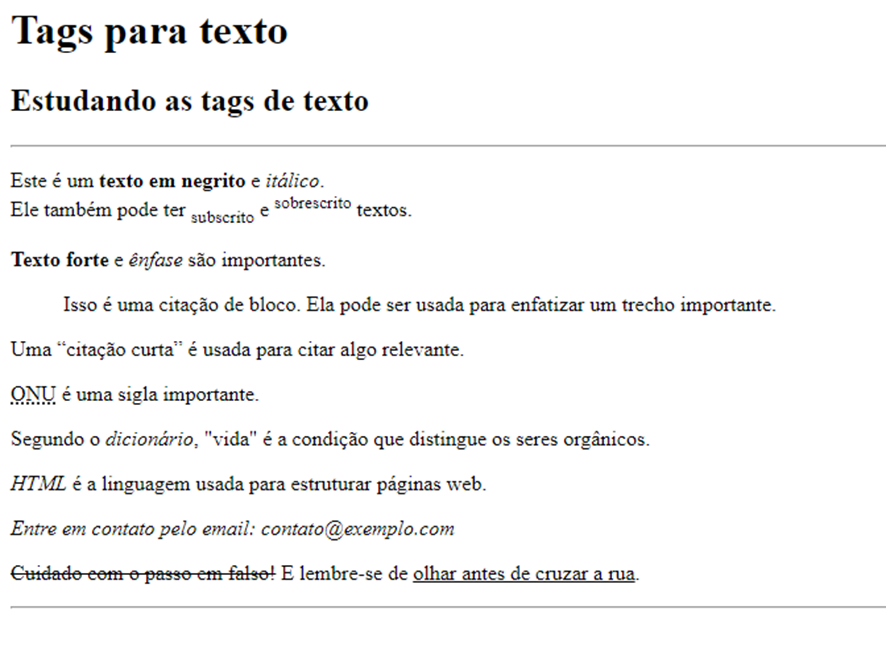
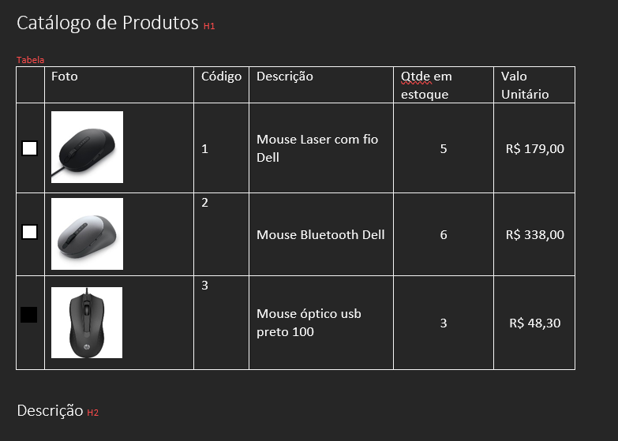
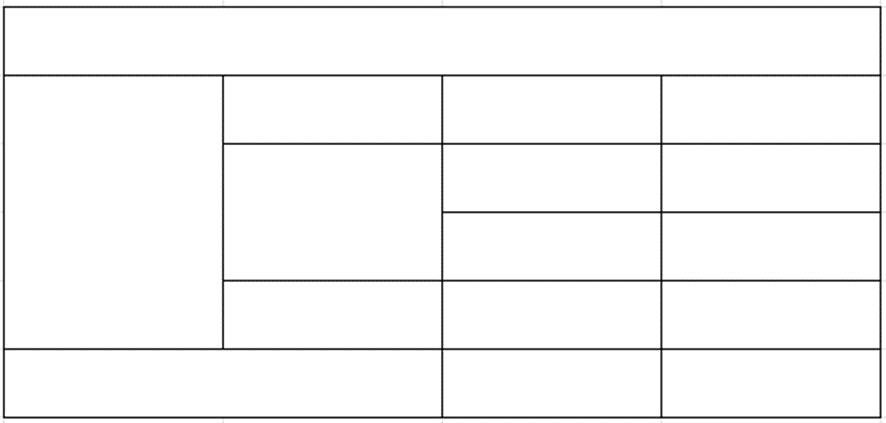
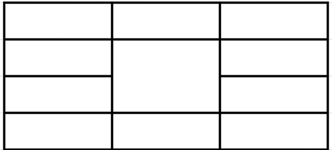

# Lista de exercicio HTML 1

1 - Utilizando as tags para a marcação de texto definidas no slide “4- Web02 HTML 5”, crie uma página html com o formato abaixo:

 
 

2 - Crie a seguinte página abaixo:

3 – Monte o código necessário para as seguintes tabelas

 
