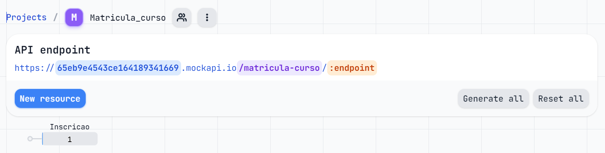

# Lista De exercicio HTML 2

### Cursos e Inscrição

Uma escola infantil de cursos de extensão precisa criar uma página HTML para listar os cursos que ela possui. Essa página deve mostrar os campos: o nome do curso, sua descrição, turno/horário, professores e valor.
Cada curso deverá ter um link para o usuário se inscrever, esse enviará para a tela de inscrição, passando como parâmetro na querystring o código do curso.

Para inscrever-se o usuário precisa informar os dados abaixo:

<ul>
<li>	Dados do aluno: Nome*, endereço, bairro, cidade, numero, cep, complemento, estado, telefone, celular*, e-mail* e cor* (Branca, Preta, Parda, Amarela, Indígena)</li>
<li>	Dados do Pai: Nome*, data nascimento, naturalidade, instrução, profissão, celular*, email*, cpf* e se é ou não responsável financeiro </li>

<li>	Dados do Mãe: Nome*, data nascimento, naturalidade, instrução, profissão celular*, email*,  cpf* e se é ou não responsável financeiro </li>
<li>	Dados do curso: Nome do curso escolhido*, data de ingresso*, valor* e forma de pagamento (qtde de parcelas)*</li>
<li>	Os campos em * são obrigatórios e não pode deixar salvar se não estiver sido preenchido.
Os dados deverão ser salvos em um API (utilize o mockapi.io).</li>

</ul>

### MokeApi



QueryString : https://65eb9e4543ce164189341669.mockapi.io/matricula-curso/Inscricao

Resposta da api na nossa aplicação:

``` json
[
  {
    "nome_aluno": "Vitor Hugo Weber Barbosa",
    "endereco_aluno": "Rua Cardeal, 344",
    "bairro_aluno": "guaçu",
    "cidade": "São Roque",
    "numero": 49,
    "cep_aluno": "18132655",
    "complemento_aluno": "jjjjjjj",
    "estado_aluno": "SP",
    "telefone_aluno": "11932107265",
    "celular_aluno": "11932107265",
    "email_aluno": "huhuhuh@gmail.com",
    "cor": "parda",
    "responsavel_financeiro": "mae",
    "nome_pai": "Ricardo",
    "data_nasci_pai": "1987-06-09",
    "naturalidade_pai": "brasileiro",
    "profissao_pai": "enfermeiro",
    "celular_pai": "11931375070",
    "email_pai": "ricardo@gmail.com",
    "cpf_pai": "41745874120",
    "nome_mae": "juliana",
    "data_nasci_mae": "2024-03-15",
    "naturalidade_mae": "brasileira",
    "profissao_mae": "professora",
    "celular_mae": "11980521074",
    "email_mae": "juliana@gmail.com",
    "cpf_mae": "52526365898",
    "nome_curso": "Um por todos e todos por um! pela ética e cidadania (UPT)",
    "data_ingresso": "2024-03-14",
    "valor_curso": "R$166,67",
    "id": "1",
    "numero_aluno": "344"
  }
]
```