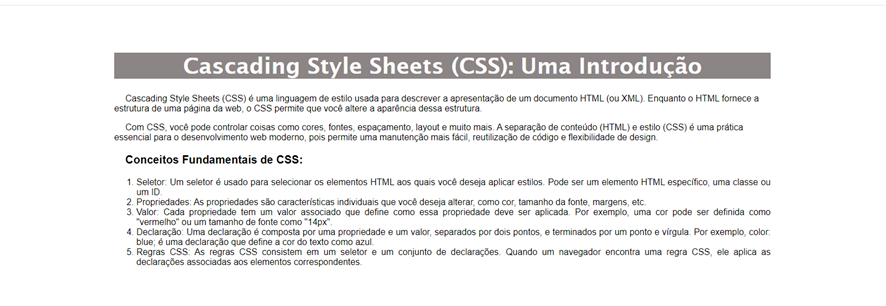

Crie uma página HTML e acrescente o texto abaixo em seu body:
Cascading Style Sheets (CSS): Uma Introdução

Cascading Style Sheets (CSS) é uma linguagem de estilo usada para descrever a apresentação de um documento HTML (ou XML). Enquanto o HTML fornece a estrutura de uma página da web, o CSS permite que você altere a aparência dessa estrutura. 
Com CSS, você pode controlar coisas como cores, fontes, espaçamento, layout e muito mais. A separação de conteúdo (HTML) e estilo (CSS) é uma prática essencial para o desenvolvimento web moderno, pois permite uma manutenção mais fácil, reutilização de código e flexibilidade de design.

Conceitos Fundamentais de CSS:
1.	Seletor: Um seletor é usado para selecionar os elementos HTML aos quais você deseja aplicar estilos. Pode ser um elemento HTML específico, uma classe ou um ID.
2.	Propriedades: As propriedades são características individuais que você deseja alterar, como cor, tamanho da fonte, margens, etc.
3.	Valor: Cada propriedade tem um valor associado que define como essa propriedade deve ser aplicada. Por exemplo, uma cor pode ser definida como "vermelho" ou um tamanho de fonte como "14px".
4.	Declaração: Uma declaração é composta por uma propriedade e um valor, separados por dois pontos, e terminados por um ponto e vírgula. Por exemplo, color: blue; é uma declaração que define a cor do texto como azul.
5.	Regras CSS: As regras CSS consistem em um seletor e um conjunto de declarações. Quando um navegador encontra uma regra CSS, ele aplica as declarações associadas aos elementos correspondentes.

Faça as seguintes alterações no texto com o auxílio do CSS
1.	Altere a cor do fundo para uma tonalidade de marrom claro, o tamanho do texto para 40px, cor da letra branca, alinhe o texto no centro e a fonte da letra para “Lucida Sans”
2.	Ao passar o mouse sobre o título o fundo deve mudar para a cor preta.
3.	O conteúdo da página deve ser mostrado com a fonte “Arial”.
4.	Todos os parágrafos devem ter um recuo de 20px.
5.	O título introdutório da lista ordenada que possui a escrita: “Conceitos Fundamentais de CSS:” deve estar com seu texto em negrito e a letra deve ter o tamanho de 20x.
6.	Os itens da lista devem estar com alinhamento justificado.
7.	Todo o conteúdo da página precisa ter um espaçamento superior e inferior de 50px e os lados precisam ter um espaçamento de 200px
Como exemplo, segue um print de como a página ficará:

