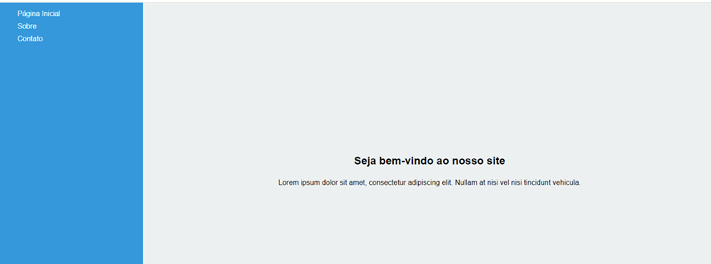
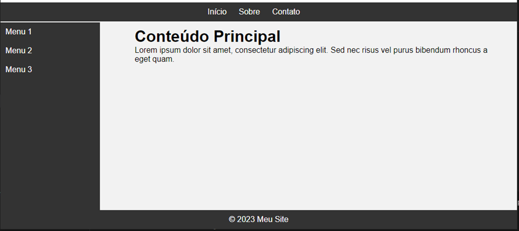

# Lista de exercicio css

## Primeiro parte

1.	Crie uma estrutura HTML básica com uma 
 para a barra lateral e outra 
 para o conteúdo principal.
2.	Estilize a barra lateral com as seguintes propriedades:
•	Largura de 20% da largura total da página.
•	Altura de 100% da altura da janela de visualização.
•	Cor de fundo diferente da cor de fundo do conteúdo principal.
•	Conteúdo de texto dentro da barra lateral, como links de navegação.
3.	Estilize o conteúdo principal com as seguintes propriedades:
•	Largura de 80% da largura total da página.
•	Altura de 100% da altura da janela de visualização.
•	Cor de fundo diferente da cor de fundo da barra lateral.
•	Alinhe o conteúdo no centro vertical e horizontalmente.
4.	Use a propriedade float para fazer com que a barra lateral flutue à esquerda e o conteúdo principal flutue à direita.
5.	Use a propriedade position para posicionar a barra lateral e o conteúdo principal de forma que eles ocupem toda a altura da janela de visualização, independentemente do tamanho do conteúdo.
6.	Teste o layout redimensionando a janela do navegador para verificar se ele é responsivo.

Segue um exemplo:

## Segunda Parte
Crie uma página HTML que tenha a seguinte estrutura de layout:
1.	Um menu superior fixo no topo da página.
2.	Um menu lateral à esquerda que ocupe uma parte da largura da página.
3.	Uma área de conteúdo à direita do menu lateral.
4.	Um rodapé fixo na parte inferior da página.
Use a propriedade position do CSS para posicionar os elementos da seguinte maneira:
•	O menu superior deve ter position: fixed; para permanecer fixo no topo da página.
•	O menu lateral deve ter position: fixed; para permanecer fixo à esquerda da página.
•	A área de conteúdo deve ter margin-left para deixar espaço para o menu lateral e não ser ocultada por ele.
•	O rodapé deve ter position: fixed; para permanecer fixo na parte inferior da página.
Personalize os estilos e os conteúdos dos menus e do conteúdo conforme desejar.

Segue um exemplo:

